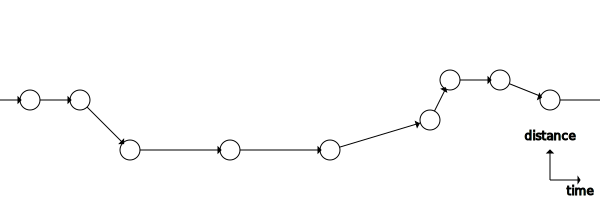
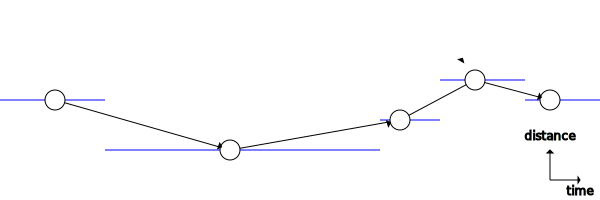
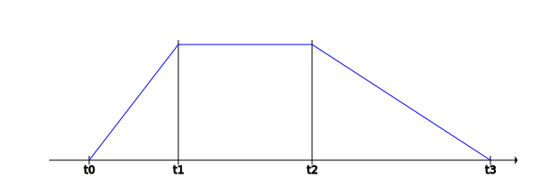
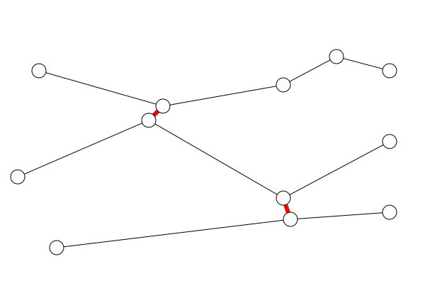

# Tracking the spread of coronavirus COVID-19 using mobile phone metadata/GPS

The current coronavirus epidemic has brought into focus the difficulties
of [contact tracing](https://en.wikipedia.org/wiki/Contact_tracing) when the
number of cases becomes large.

In nerd-speak it doesn't scale well.

This document explores how one might automate contact tracing and also scale it up; perhaps
to the entire population of the UK or the entire planet; probably, using data from mobile
phone records. This article uses numbers for the UK - population a little over 60 million.
For the entire planet, 7 billion people with about half now having mobile phones, you'd
need to multiply by between 50 to 100.


## Data sources - Big Brother

There are a number of big organisations that might just have the required data. These include:

* Mobile Phone Operators
* Government Security Services
* Phone OS suppliers (Google & Apple)
* Social/Mobile/App platforms (Microsoft, Facebook, Twitter)
* Other app or device providers (e.g. fitness trackers/apps)

This document refers to these as 'Big Brother'. It is way out of the scope of this
document to even begin to imagine how any of these Big Brother organisations might be
persuaded to part with or share this information.

This does, of course, also raise a few privacy issues (No kidding!).


## Privacy issues

I am not going to spend time discussing privacy issues; mainly because it's not a
technical issue. So let's just say it's somebody else's problem.

Possibly might expand this section if there are any obvious ways in which a software
solution could limit the privacy issues.

## Some assumptions

There are quite a few assumptions been made. Some of these are noted here. If these assumptions are incorrect this affects the potential accuracy of any results.

* It is assumed that there is a 1:1 relationship between phones and people. This isn't
completely true but is probably a good first approximation. There are actually 80
million phones in the UK for a population of 66 million. But many of those phones
are probably sitting in a drawer somewhere. Things may be very different in
3rd world countries with a single phone being shared between family members.
* it is assumed there is a 1:1 relation between phone encounters and people
encounters. This isn't true if someone leaves their phone in the car or at home.
They may then have a number of encounters that are not recorded.

For the purposes of this document I am assuming that access can be obtained to
the entire mobile phone metadata/GPS records of an entire country. The UK, for
example, has somewhat more mobile phones than people around 80 million phones
for around 66 million people. 

TODO: 1:1 relationship between phones and people - however in many 3rd world countries may not be true.


## Source data

Several organisations, potentially, hold such information. The phone companies keep metadata. The government's security services also collect and use this sort of information. The phone operating system owners (Apple/iOS and Google/Android) collect such data. Social networks (like facebook) are likely to be collecting this information. Other possible sources, might include fitness apps, or satnav applications.

To make this work, one would need data running over at least the last few weeks and preferably back to the time of the start of the outbreak. This might be considered to vary from country to country.

In addition, to mobile phone data, any software implementation would also need a list of phones belonging to anyone confirmed as having the virus. It would also be useful to have a list of anyone definitely cleared of the virus (the negative result is potentially useful as a way of ruling out some possibilities when trying to set probabilities of infection).


## Data format

I am going to assume that the source data might consist of a set of data records for each phone. Each record would be a single observation - with a time/date stamp and an approximate location.



*FIG 1 A raw phone record is assumed to be a timeline of events. Each event will also include some position information.*


## Pre-processing of data

The first step in processing data would probably be to aggregate together different sources, using the phone number, user email/google account or the phone's internal serial number (EMEI?). There isn't much to be said about this; given the absence of actual data.

TODO: Add some notes about the possibility of 'Jitter' in the input data and how to
filter it out.


The next step in handling the data would be to convert from a list of observations at different points in time (and location) (FIG 1) to a list with each entry having an approximate start and end at the same location (FIG 2). This would reduce the number of data-points but each entry would be slightly more complex.



*FIG 2 Shows the same data as in FIG 1 but converted to a sequence of
locations. Each location now has a time period, here indicated by 
the blue line.*

In practice, the diagram above is not ideal. The blue lines (time period) are estimated by simply dividing the time between two event in different places in half. A better approach might be to calculate a probability over of time. The first possible time t0, that the phone could be at the location. The first moment in time, t1, when the phone was definitely at the location and, t2, the last time the phone was definitely at that location, and finally t3 the last moment the phone might have been at that location.



*FIG 3 Shows the probability of the phone being at that location*

When trying to calculate the probability of infection transfer, simply work out the area under the line where the two overlap.


## Finding Encounters

An encounter is when two phones (and therefore two people) are in close proximity and for an overlapping period of time. It isn't a simple binary flag but is probably a number - in some way relating to the risk of cross-infection. The closer the proximity and the longer the time overlap, the higher the risk.  

Graphically, the phone data may be seen as millions of separate time-lines. Identifying a close encounter joins a node in one phone thread to a node in another. This large graph|net is the structure across which a virus can spread. 



*FIG 4 Solid black lines indicate a phone moving from one place to another place later in time.
Thicker red-lines represent encounters between phones. These do not have a time direction.
An infection could move in either direction across these links.*

VERY NERDY NOTE: Looks a bit like a [Feynman diagram](https://en.wikipedia.org/wiki/Feynman_diagram). Two particles|phones which have time arrows are drawn as interacting, with an exchange particle. The exchange particle doesn't have a time arrow. Which in our case, means either person might infect the other.

Identifying encounters is probably the largest challenge to be described here. For the
UK you might have 50 million phones and you might want to track back over a few months. That might imply 3 billion phone-days worth of records.

With an estimated 50m phones there are 50m * 50m (divided by 2) tests to run, ie.12.5*10^14 or 1,250,000,000,000,000. That's quite a big number. At 1 million comparisons a second it would take nearly 4 years.

Encounters can be found independently of other calculations. It needs to be done once, before running other possible algorithms. It would only need to be recalculated when new 
data is added or old data is changed.

So, instead, the data should be pre-processed to find candidates that might be worth comparing. Start by selecting a period of time - say 1 day. Then for each phone|person construct a bounding box. This would be from the start of the period of time to the end; from the westernmost point they travelled to the easternmost point; from the southernmost point to the northern most.

The result of this pre-filtering would be up to 50m sets of results, each set would consist of 1 main phone and it's bounding box and then one or more phones that have bounding boxes that overlap this one.

NOTE: As described this would lead to redundant checks as phone A would compared with phone B and then later B would be compared with A. TODO: find a fix for this.

For the primary phone and for each of the others, now compare each data point and see if there is any overlap. If found assign it a value.


## Algorithm 1 - Assigning probability of infection to each phone

This algorithm sets out to assign a probability of infection based on closeness with known infected cases.

1. As a first step, use a confirmed case to mark the matching phone-timeline. If
time of onset of symptoms is known, a probability of being infectious can be
assigned for each location before and after this time. This is treated as
'hard' data as it is based on an actual test result.
2. Repeat the above for all new confirmed cases.
3. Now use all of the encounters that relate to the period of infectiousness to assign a score of getting infected to the other phone in the encounter.
4. Note: that this score is additive, so if there were several encounters each one would increase the score.
5. Repeat this process outwards zero or more times.

The result of this process would be a list of phones with a score. The higher scores being for those people most likely to be carrying the virus.


#### Using negative results

Negative test results are, potentially, a useful source of new data. If someone tests negative, then they haven't got the virus, they didn't have it at any location/close encounter in the past. They haven't passed the virus on to anyone and haven't got the virus from anyone. This means that their phone record can be forcefully zero'ed out for all past locations. This has the effect of creating a barrier in the large graph|net constructed. The negative tests mean at no point has the virus crossed from one phone|person to another via this phone.

NOTE: All of that is based on the assumption that the test doesn't produce a huge
number of false negative results (or indeed false positive results).


## Algorithm 2 - Identifying hidden carriers

At this point we should have a graph/net made up of 50m separate phone data threads running over an extended period of time (several weeks). These are cross-linked with the 'encounters' found
earlier.


This large graph has now been decorated with, all the known infected cases and all the known negative tests. This is hard data. There is also now a set of probabilities estimating the likelihood of any one individual being infected (and/or having become infected at some location). This might be thought of as soft data - and will change the next time calculations are run. 

Note: that this tree of probabilities runs downstream, going from an event in the past to later events in the now or the future.

This algorithm will atttempt to go in the opposite direction - upstream - building a tree of possible infection sources for an identified infected person. The infected person is used to identify their phone. Each location (location == a set of close encounters) prior to the positive test result, increases the number of possible sources.

The total of all these separate possibilities should add up to 1. (Ignoring the remote option of 
someone being infected twice.) So we take the total probabilitiy of 1 and we smear it across all 
the known close encounters running back over a number of days. With a preference for longer|closer
encounters and with a higher likelihood around 3 or 4 days before the first onset of symptoms.

For each new case, without a known origin, would check that phone, would assign probabilities to say 40+ locations, and maybe 400+ close encounters, made over the last few weeks. The process could then be repeated for each of these contacts, and possibly again.  

Now for each friend and friend of friend and so on, compare the probability of being the source of an infection with the probability of having been infected - from an earlier algorithm.

Where the probability of being infected is a bit higher - this should increase the probability that this is the source. This part of the algorithm might be re-run multiple times, reusing the newer probabilities, until it homes in on a likely result.


#### Implementing in SQL

Below is a possible, simplified implementation using standard SQL. In practice, there might be good aguments for using a non-SQL database or possibly a graph datatabse. 

Phones Table

| PhoneID* | PhoneNumber | more fields... |
| -------  | ----------- | -------------- |

For the UK one might expect around 50 million records in this table. The PhoneID would be the primary|unique key. 

It is possible that some Big Brother records might relate to a person more than to one single device. For example, facebook, twitter or google data might be held by user account more than by the specific ID of one device. Not sure that this actually makes much difference.


___

PhoneLocations Table

| PhoneID* | LocID* | X0 | X1 | Y0 | Y1 | T0 | T1 | T2 | T3 |
| -------  | ------ | ---| ---| ---| ---| ---| ---| ---| ---|

This holds a bounding box (an area combined with a length of time) for each
identified location on the phone's time-line. The first half of the primary key - would match the PhoneID. 

X,Y values are probably FLOAT or a special GIS type. T values might be FLAOT or some TIMESTAMP.

Might anticipate something like 6 times as many locations per day as phones. So 300m per day; say up to 3 months, or 90 days of data implies 2.7 billion records.

___

Encounters Table

The 'Encounters' table might look like:

| PhoneID1 | LocID1 | PhoneID2 | LocID2 | SpatialScore | TemporalScore |
| -------- | ------ | -------- | ------ |------------- | ------------- |
| (FK)     | (FK)   | (FK)     | (FK)   |              |               |
| 123456   | 1234   | 123457   | 1212   | NULL         | NULL          |
| 234567   | 2345   | 234568   | 2222   | 11           | 5             |

Each record contains the IDs of two locations and a spatial and temporal score. It
might make sense to add secondary indexes to this table but simply to improve
performance.

The temporal score is some number that indicates how long the encounter
probably lasted. It might be in seconds, minutes or hours.

The spatial score is a measure of closeness or the reciprocal of distance.

___

Some simple SQL statements:

```
  # select a phone and it's time-line
  SELECT * FROM Phones WHERE PhoneID = :id;
  SELECT * FROM PhoneLocations WHERE PhoneID = :id ORDER BY T1; 

  # select encounters for a given phone :id
  SELECT * FROM Encounters WHERE PhoneID1 = :d OR PhoneID2 = :id;
```

___

#### Incremental Implementation

Rather than describe the implementation on the entire dataset, this description assumes that the data will be added incrementally. This is probably a more realistic proposition it may also help to clarify processing requirements.

1) Adding a new phone

```
  INSERT INTO 
    Phones (PhoneID, PhoneNumber, more fields...)
  VALUES 
    (:pid, 'phone number', ...);
 ```


2) Adding a phone time-line - single location

Finding 'encounters' is likely to be computationally intensive and might go up as the square of the number of phone records O(n*n). However, that is perhaps misleading, in most cases adding a new phone would only require comparing the new phone with a few dozen or a few hundred phones that have been in the same area. 

The number of other phones a phone has come close to in a given period is fairly constant whether you are handling 50 thousand or 50 million. The workload stays the same - the difficulty is in filtering out the distant phones and only having to perform the calculation on the potential matches. Fortunately databases with indexes can do this sort of thing in log(n) time. 


```
  INSERT INTO 
    PhoneLocations 
    (PhoneID, LocID, X0, X1, Y0, Y1, T0, T1, T2, T3)
  VALUES
    (:pid, :lid, :x0, :x1, :y0, :y1, :t0, :t1, :t2, :t3);

  INSERT INTO
    Encounters
    (PhoneID1, LocID1, PhoneID2, LocID2, SpatialScore, TemporalScore)
    SELECT
      :pid, :lid, l.PhoneID, l.LocationID, NULL, NULL 
    FROM 
      PhoneLocations l
    WHERE
      (X0 <= :x1 AND X1 >= :x0) AND (Y0 <= :y1 AND Y1 >= :y0) 
      AND (T0 <= :t3 AND T3 >= :t0);
```

NB: This process is not really parallelizable. So all of the above probably needs to be wrapped up as a transaction. 

If using GIS features/ column types the WHERE statement can probably be made less clunky.


3) deleting a phone and it's time-line

At first glance, this feature isn't really needed but it might be the simplest way to fix errors.

```
  DELETE FROM Encounters WHERE PhoneID1==:id OR PhoneID2==:id;
  DELETE FROM PhoneLocations WHERE PhoneID==:id;
  DELETE FROM Phones WHERE PhoneID=:id; 
```

If referential integrity/cascading deletes is setup on the database, this can be simplified. Although, it isn't exactly a problem.


4) appending|inserting|prepending locations to an existing phone

Typically new, more recent, data will arrive and will need to be appended to
the existing data.

Firstly, this will ensure there is a master phone record:

```
  REPLACE INTO 
    Phones (PhoneID, PhoneNumber, more fields...)
  VALUES 
    (:pid, 'phone number', ...);
```

Then re-use the code from (2) above.

This should work fine for prepending or appending data. As long as the new
data doesn't have a time overlap with any existing data. A test for this might be:

```
  SELECT
    * 
  FROM 
    PhoneLocations
  WHERE 
    PhoneID=:pid 
    AND ((T0 <= t3) AND (T3 >= t0))
```

If this produces results then there is a potential clash between old and
new data. If the next SQL statement produces results then there is a
definite clash; however if it is empty it means the possible overlaps need to be changed. 

```
  SELECT
    * 
  FROM 
    PhoneLocations
  WHERE 
    PhoneID=:pid 
    AND ((T1 <= t2) AND (T2 >= t1))
```

If the new data fails this test it would probably make sense to simply deletee the phone record and re-import from the updated raw data.

A similar issue will apply for x & y values. However, this might require a different solution.


5) scoring or rescoring encounters

Can obtain a list of records that need processing:

```
  SELECT * FROM Encounters WHERE SpatialScore==NULL OR TemporalScore==NULL;
```

Could force re-scoring by setting scores back to NULL.

And once scores have been calculated, use:

```
  UPDATE 
    Encounters
    (PhoneID1, LocationID1, PhoneID2, LocationID2, SpatialScore, TemporalScore)
  VALUES 
    (pid1, lid1, pid2, lid2, sScore, tScore);
```

The temporal tScore, is simply the size of the overlap of the time periods of each phone-location. Where the phone 'may' have been at the location simply use a straight line estimate. The longer the overlap the higher the tScore. 

```
  function scoreTemporal(ta0, ta1, ta2,ta3, tb0, tb1, tb2, tb3) {
    var
      t0 = (ta0 < tb0) ? tb0 : ta0,
      t1 = (ta1 < tb1) ? tb1 : ta1,
      t2 = (ta2 < tb2) ? ta2 : tb2,
      t3 = (ta3 < tb3) ? ta3 : tb3;
    //this is slightly inaccurate doesn't handle cases where the slopes intersect
    // before/after the horizontal areas  
    return (t1-t0)/2 + (t2-t1) + (t3-t2)/2;
  } //scoreTemporal
```

The spatial score is somewhat harder. One method would be to consider the size of the overlap of the two bounding rectangles relative to their parents. The probability of being in the overlap for one phone is o/r; where o is the area of the overlap and r is the area of the original rectangle. For both phones to be in the overlap it would be:
(o/ra) * (o/rb)).

However, that isn't the whole story.

Often the bounding rectangles will be the same for both phones (for example if the box is defined by the size of the mast's cells, or if the geocoding is in the form of a postcode). The previous expression gives a higher score if there is a lot of overlap - but if the overlap is large then the score should be low.

So the score should be the reciprocal of o scaled by the probability above. Something like:

```
  sScore = 1/o * o/ra * o/rb;

  or:

  sScore = o/(ra * rb); 
```

```
  function scoreSpatial(xa0, xa1, ya0, ya1, xb0, xb1, yb0, yb1) {
    var
      ra = (xa1-xa0) * (ya1-ya0),
      rb = (xb1-xb0) * (yb1-yb0),
      x0 = (xa0 < xb0) ? xb0 : xa0,
      x1 = (xa1 < xb1) ? xa1 : xb1,      
      y0 = (ya0 < yb0) ? yb0 : ya0,      
      y1 = (ya1 < yb1) ? ya1 : yb1,      
      o = (x1-x0) * (y1-y0);
    return o/(ra * rb);
  } //scoreTemporal
```
___


#### Implementing pre-processing


Given say 50m phones, and maybe 100 samples per day, and say 100bytes per observation; the dataset would be about 50 * 100 * 100 MB, i.e 500GB per daya as plain text - say 45 TeraBytes for 3 months of data. If stored slightly more efficiently as 4 doubles (32bytes) , then around 14TB.

Stored in an SQL server would be 5 billion records per day or 450 billion for 90 days of data.

```
# SQL to pull out one phone's observation records
SELECT id, timestamp, lat, long FROM RawPhoneData WHERE id = 'phoneID' ORDER BY timestamp; 
```

If we assume an average of 6 places per person/phone per day. Then this dataset comes down to (50m * 40 * 8 * 90) 1.4TB. Not too extreme.

Basically read in 50m sets of records and then output. 

```
// in pseudo-code

function processRawPhone(phone) {
  var result = [];
  //work through data from oldest to newest
  //track first-last timestamp, for as long as the location stays the same.
  //push each location to the result, don't forget to also push the last one :-)

  return result;
}

var phoneData = rawPhoneData.map(processRawPhone);
```

This dataset would, likely, be significantly smaller than the first.
People (and their phones) spend many long hours in the same place, at home,
at work, at school. For many/most? people there would be, perhaps two 
main locations for each day, and then a small number of other places in
between: shops, restaurants, pubs, etc. So data entries might come 
down to somwhere like 2 to a dozen entries per day.
 
___
#### Implementing algorithm 1

TODO:
___

#### Implementing algorithm 2

TODO:

___
#### Implementation - data formats as JSON

```
//data in JSON like format

rawPhoneData = {
  phoneID: [
    {
      timestamp: '2020-01-01T00:00:01', 
      long: 0.111, //or other possible location data 
      lat: 53.1234 //eg mast, grid ref.
    },
    // ... more observations
  ],
  // ... more phones
}
```

```
// in JSON like format
phoneData = {
  phoneID: [
    {
      x0: r, x1: r,  // bounding box of location derived from position 
      y0: r, y1: r,  // and some error estimate
      t0: ts, t1: ts, t2: ts, t3: ts 

    },
    // more observations
  ],
  //... more phones  
}
```
___